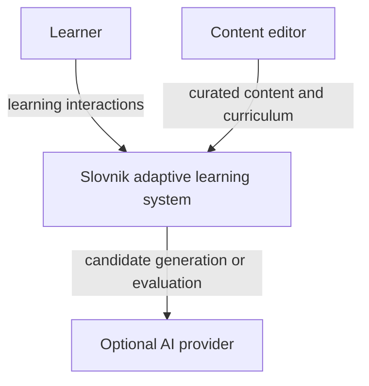
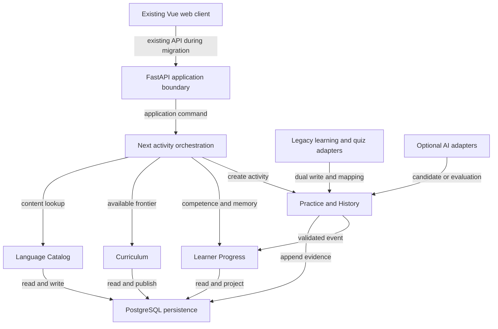

# ADR: Доменная основа адаптивного языкового ассистента

> **Статус:** Accepted

- Дата: 2026-08-26
- Основание принятия: доменная модель и границы AI подтверждены пользователем 2026-08-26;
  повторная архитектурная проверка не выявила блокирующих противоречий
- Тема: переход Slovnik от card-centric тренажёра к адаптивному языковому ассистенту
- PRD/brief: [`../superpowers/specs/2026-08-26-domain-model-v0.1-design.md`](../superpowers/specs/2026-08-26-domain-model-v0.1-design.md)
- Теоретическая основа: `/Users/launert/deep-research-report.md`
- UX: нет; UI не входит в решение

## 0. Коротко

- **Зачем** — текущий Slovnik предлагает отдельные режимы новых слов, review и quizzes, но не
  формирует единый учебный путь. Один word-level progress одновременно изображает знание,
  забывание и weakness, поэтому система не может надёжно решить, что learner должен делать дальше.
- **Решение** — строим модульный монолит с четырьмя доменными областями: Language Catalog,
  Curriculum, Practice & History и Learner Progress. Next-activity orchestrator выбирает действие
  только среди curriculum-valid candidates, опираясь на отдельные competence и memory projections.
  Исторической истиной становится immutable learning event.
- **Что меняется для пользователя** — этот ADR сам по себе не меняет runtime. После реализации
  разрозненные режимы смогут стать единым адаптивным flow, который чередует acquisition, review,
  strengthening и assessment.
- **Чем платим** — появляется больше stable domain identities и versioned artifacts; миграция
  некоторое время поддерживает старую и новую модели параллельно; curated curriculum/content
  остаются обязательными; sophisticated ML и unrestricted AI осознанно отложены.
- **На конкретном примере** — если lexical sense хорошо распознаётся, но плохо извлекается, а его
  memory risk высок, система выбирает written retrieval activity для этого sense. Она не повторяет
  MCQ только потому, что старый word row помечен weak, и не открывает новый target в обход HARD
  prerequisite.
- **Куда смотреть дальше** — §3 фиксирует архитектурное решение и инварианты; §4 сравнивает
  альтернативы; §7–8 показывают system/data flow; детальная модель агрегатов находится в PRD/brief.

## 1. Контекст

Теоретическая модель требует раздельно представлять Serbian language structure, curriculum,
learner competence, memory и learning activity. Текущая реализация сводит content к одной flat
vocabulary row, а learner progress — к одной word-level row, которую одновременно меняют new-word,
review и quiz flows.

Решение затрагивает:

- backend domain/application layers;
- persistence и migrations;
- learning, review и quiz services как будущие legacy adapters;
- curriculum/content administration как будущий источник published artifacts;
- frontend только как будущего consumer unified activity flow, но не в foundation-этапе.

Ограничения:

- текущий стек — FastAPI, SQLAlchemy, Alembic и PostgreSQL; тесты используют также SQLite;
- миграция должна быть эволюционной, без big-bang переключения;
- текущие learner IDs и vocabulary references нельзя потерять;
- authentication остаётся отдельной проблемой и не проектируется этим ADR;
- UI, mobile и production AI integration находятся вне scope.

## 2. Текущее состояние

- `VocabularyItem` объединяет lexical identity, один meaning, обе письменности, CEFR, theme и
  examples.
- `UserWordProgress` объединяет lifecycle status, exposure counters/timestamps, weak state и
  review schedule.
- New words выбираются exact-фильтром по preferred CEFR и отсутствию progress row.
- New-word completion фиксирует batch exposure, но не индивидуальный learning evidence.
- Review self-rating напрямую меняет memory, weak state и persisted `learned` status.
- Quiz selection, activity plan, scoring, partial history и progress mutation принадлежат одному
  service flow.
- `QuizAnswer` является частичным event-like record; review/new history не сохраняется.
- New/review sessions не имеют stable persisted identity.
- AI vocabulary fill является editorial subsystem и не участвует в learner path.

Основной узкий участок — `UserWordProgress`: его невозможно расширить до multidimensional learner
state без дальнейшего смешивания competence, memory и history.

## 3. Решение

Выбирается модульный монолит с явными domain boundaries и layered application orchestration.
Backend domain modules не зависят от FastAPI/SQLAlchemy contracts; application services связывают
domain policies, persistence и legacy adapters. ORM и migrations остаются infrastructure layer.

### Language Catalog

Catalog владеет `LexicalUnit`, `Sense`, `Form` и `Construction`. Он хранит только проверенный
Serbian content и stable identities. Для MVP создаются лишь реально изучаемые forms; examples
остаются embedded. Published content не удаляется физически после появления внешних references.

Persistence добавляет отдельные catalog entities и legacy mapping. Нужны индексы по stable
references и editorial lookup, без cache layer в первой версии. Catalog publish является
транзакционной границей. Права на content editing остаются на application boundary; существующий
shared editor secret не становится частью domain model.

### Curriculum

Curriculum владеет immutable published `CurriculumVersion`, nodes и typed prerequisite edges.
Каждый node адресует `TargetSpec`: target, capability, modality и optional condition. CEFR живёт как
outcome/curriculum association, а не как intrinsic word difficulty.

Publishing проверяет разрешимость references и ацикличность HARD graph. SOFT edges никогда не
блокируют activity. Published curriculum читается напрямую из persistence; caching откладывается до
появления измеримой потребности. Foundation не вводит локализационный или UI contract.

### Practice & History

Practice владеет `PracticeRun`, `ActivityInstance`, `Submission` и immutable `LearningEvent`.
Activity хранит snapshot target, stimulus и policy/scorer versions. В MVP activity elicites один
primary target, чтобы evidence оставался интерпретируемым.

Submission обрабатывается идемпотентно. Фиксация результата создаёт immutable event; learner state
является projection и может быть пересчитан. Learner-scoped access проверяется на application/API
boundary. Event history не кэшируется и не редактируется.

### Learner Progress

Learner Progress владеет learning profile и sparse `LearnerTargetState`. State создаётся только для
target specifications, по которым получено evidence. `CompetenceEstimate`, uncertainty,
`EvidenceSummary` и `MemoryState` остаются разными value objects внутри одной consistency boundary.

Concurrent updates сериализуются для пары learner/target. Current retrievability влияет на review
priority, но не отзывает curriculum unlock. Canonical `known`, permanent `mastered` и word-level
weak truth запрещены.

### Selection и AI policies

`NextActivityOrchestrator`, `CurriculumFrontierPolicy`, `ActivityValidityPolicy`,
`SelectionPolicy`, `LearnerStateProjector` и `MemoryPolicy` являются versioned domain/application
services, а не отдельными bounded contexts.

Curated/deterministic providers используются по умолчанию. AI может реализовать только порты
candidate generation или response evaluation. Его output проходит structural/domain validation,
сохраняет provenance/confidence и не может напрямую менять curriculum, event history или learner
state.

### Migration policy

Новые entities вводятся рядом с legacy tables. Старые vocabulary/progress/quiz данные получают
explicit mapping и low-confidence bootstrap projections. История, которой нет, не синтезируется.
Новые flows сначала dual-write events и shadow projections. Legacy APIs остаются adapters до
отдельного migration/LBS решения о переключении consumers.

### Инварианты решения

- Stable target identity не переиспользуется для другого meaning.
- Published curriculum/content references остаются разрешимыми.
- HARD graph ацикличен; SOFT edge не блокирует activity.
- Recognition не создаёт productive evidence; exposure не считается retrieval.
- Self-report и model-assisted evaluation не маскируются под deterministic correctness.
- Learning event immutable и idempotent.
- Learner state replayable и хранит projection policy version.
- Competence и memory не объединяются в один mastery score.
- AI не владеет progression и state mutation.

## 4. Рассмотренные альтернативы

### Вариант A: восемь bounded contexts из theoretical model

Плюсы:

- максимально чистое разделение concerns;
- независимая эволюция memory, history и adaptation;
- удобная основа для будущего service split.

Минусы:

- избыточные contracts и synchronization для A1 MVP;
- высокая стоимость разработки и эксплуатации;
- границы не подтверждены независимыми consistency/ownership needs.

### Вариант B: расширять текущую word/card-модель

Плюсы:

- минимальная начальная миграция;
- сохранение существующих services и API почти без adapters;
- простой mental model для vocabulary-only product.

Минусы:

- сохраняет word-level mastery и card-centric scheduler;
- CEFR/content/memory остаются смешаны;
- constructions, capabilities и immutable evidence потребуют нового переписывания.

### Вариант C: четыре contexts в модульном монолите

Плюсы:

- сохраняет ключевые научно и доменно необходимые различия;
- допускает эволюционную миграцию;
- не требует преждевременного service split;
- оставляет policy implementations заменяемыми.

Минусы:

- внутренние module boundaries придётся дисциплинированно соблюдать;
- Practice & History и Learner Progress пока содержат несколько closely related concerns;
- потребуется explicit contract ownership при будущем выделении frontend/mobile SDD.

## 5. Обоснование

Выбран вариант C. Он устраняет текущий архитектурный тупик — смешивание content, evidence, memory и
mastery — и одновременно соблюдает MVP/YAGNI. Четыре contexts соответствуют реальным ownership и
consistency boundaries, тогда как восемь theoretical areas пока являются картой concerns, а не
основанием для восьми runtime modules или services.

Сознательно принимаются три trade-off: embedded examples вместо отдельного corpus; один primary
target вместо multi-target evidence; deterministic policies вместо premature ML. Stable IDs,
immutable events и versioned policies сохраняются с первого этапа, потому что восстановить их
задним числом существенно дороже.

## 6. Риски

- **Риск 1: слишком мелкая target granularity.** Снижение риска — материализовать только targets,
  которые реально измеряет MVP, и расширять taxonomy additively.
- **Риск 2: dual model drift.** Снижение риска — explicit legacy mappings, dual-write и shadow
  comparison до переключения reads.
- **Риск 3: event/projection divergence.** Снижение риска — idempotency, projection versions и
  возможность replay из immutable history.
- **Риск 4: over-credit слабого evidence.** Снижение риска — сохранять operation, cues и evaluation
  provenance, а вес определять versioned projector policy.
- **Риск 5: AI false grading.** Снижение риска — ограниченные ports, confidence/provenance,
  deterministic validation и fallback.
- **Риск 6: foundation без пользовательской ценности.** Снижение риска — SDD строит вертикальные
  фазы, каждая из которых даёт проверяемый read/shadow capability до UI switch.
- **Риск 7: накопление чувствительной learning history.** Снижение риска — foundation хранит только
  bounded exercise responses; до free-form/conversation input обязателен отдельный retention,
  export и deletion design.

## 7. C4: Context

## 8. C4: Container & Data Flow

- API/application boundary валидирует learner ownership и command input.
- Orchestrator читает published curriculum, catalog и learner projections синхронно.
- Practice сохраняет immutable evidence и запускает versioned projection update.
- Legacy adapters dual-write только в migration phases; old consumers продолжают работать.
- AI interaction опциональна и не входит в транзакцию curriculum/state ownership.

## 9. Допущения и открытые вопросы

- `(допущение)` Первый implementation slice является backend-only foundation без UI/API switch.
- `(допущение)` MVP начинает с written modality и deterministic selection/evaluation policies.
- `(допущение)` Existing learner IDs сохраняются как legacy identity keys до отдельного auth design.
- `(допущение)` PostgreSQL остаётся production target, SQLite — test compatibility target.
- `(вопрос)` Точный момент переключения legacy new/review/quiz consumers определяется отдельным
  migration SDD после LBS-аудита текущего поведения.
- `(вопрос)` Model-assisted evaluation включается только после отдельного scorer validation design.
