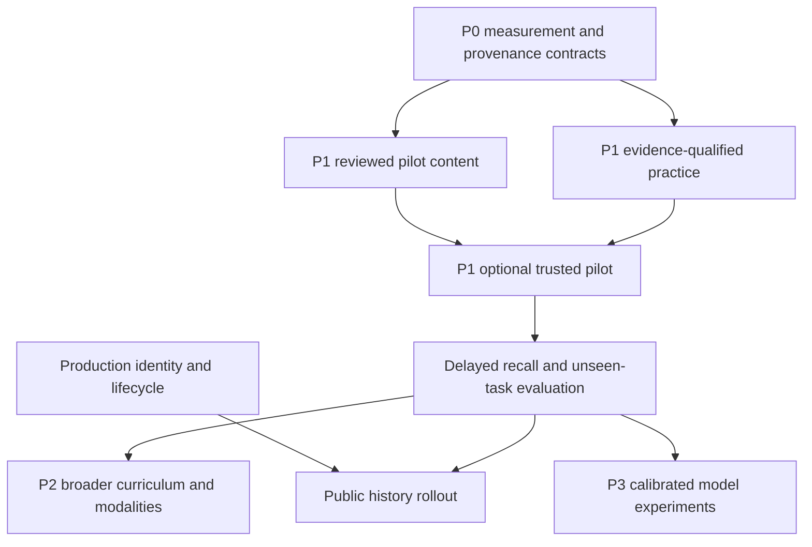

# Evidence-based learning redesign roadmap

Status: **proposed, not implemented or approved for execution**. Prepared 2026-09-24 against
repository revision `fd5c44d`; reviewed against the current checkout in
[review](review.md). This task changes documentation only. The executable P0 ordering is in
[implementation-plan](implementation-plan.md).

**Goal:** make teaching, sequencing, practice and progress claims traceable to communicative
outcomes, reviewed Serbian material and interpretable learner evidence.

**Architecture:** extend the existing Language Catalog, Curriculum, Practice & History and
Learner Progress contexts in the FastAPI/PostgreSQL modular monolith. Preserve immutable events,
replay, content freshness checks, the legacy product and the Vue frontend while adding a small
optional curriculum pilot. Corpus work is offline; no new service or graph database is required.

**Design inputs:** [current audit](audit.md), [research and evaluation](research.md),
[Serbian resource register](serbian-resources.md), [learning model](learning-model.md),
[content pipeline](content-pipeline.md), and the
[accepted domain ADR](../adr/ADR-language-assistant-domain-model-2026-08-26.md).

For a later implementation session: select one task below, read its design inputs and named
files, verify the repository still matches this audit, and use the appropriate implementation
workflow (`superpowers:executing-plans` or `superpowers:subagent-driven-development` if chosen).
Do not execute this whole roadmap merely because the document exists. No model upgrades,
large corpus downloads, production history enablement or efficacy claims are authorized by it.

## Global constraints and review focus

- Keep existing user flows functional until an explicit replacement release. Changes to score
  semantics must be additive/versioned and clearly labeled.
- Preserve the source-of-truth distinction between legacy public behavior and internal shadow
  behavior. No LLM directly selects learning truth or mutates learner state.
- Retain immutable first-response evidence, activity/content/policy versions and replayability.
  Missing historical evidence remains unknown.
- Production shadow/public history stays behind trusted-identity and data-lifecycle gates.
  The initial pilot is supervised and loopback-only in `local/development/test`, with consented
  data handling. Any remote/non-local enrollment requires P2-01 and P2-02 first. New direct
  practice writes must enforce these gates explicitly; shadow configuration alone does not protect them.
- Preserve both scripts, valid Serbian variants and sense distinctions. No CEFR certificates
  inferred from word counts, session completion or a threshold in code.
- Update [product-state](../product-state.md) when each future change ships. Reversible migrations
  must preserve unrelated legacy data and intentionally changed files only may be committed.

Review particularly: answer keys changing mid-attempt; hints/retries mistaken for independent
success; transliteration or duplicate contexts leaking into tests; wrong/unknown license or
ambiguous morphology silently accepted; and cold-start/long-absence learners blocked by workload
or hard prerequisites. Each is assigned tests below.

Effort estimates are rough **engineering/editorial effort**, not calendar promises: S ≈ half to
one focused session; M ≈ one to three sessions; L means a coherent milestone requiring its listed
subtasks. Corpus storage, native-speaker review and user recruitment are separate costs. Every
numeric pilot threshold is a proposed product/measurement decision unless explicitly supported
by research; finalize thresholds before looking at pilot outcomes.

## Dependency order and release boundaries



P0 establishes measurement, quiz integrity, a source decision and a finite pilot brief without
new content tables. P1 may deliver a narrow written pilot using reviewed authored examples;
corpus and lexicon imports are optional investigations after that pilot shows a coverage gap.
P2 adds useful coverage and production readiness. P3 contains experiments whose benefit remains
uncertain. Tasks are independent review units, with explicit dependencies.

## P0 — foundations before further content expansion

### P0-01 — Freeze evidence definitions and a baseline evaluation fixture

- **Objective/rationale:** distinguish exposure, recognition, unaided production, self-report,
  repair and delayed transfer before interpreting scores. Existing quiz totals mix these.
- **Components:** new `docs/testing/learning-evaluation.md` and small
  `backend/tests/fixtures/learning/` fixtures; inspect `domain/practice.py`,
  `services/learner_projection_service.py`, `services/quiz_service.py`.
- **Dependencies:** none; uses this research set.
- **Acceptance:** versioned metric definitions with numerator, denominator, exclusion and missing-data
  rules; fixture histories for wrong→repair, hint→correct, self-rating, same-context repeats,
  independent delayed correct and ambiguous answer; baseline behavior recorded separately from desired behavior.
- **Tests/measurements:** manually reconcile fixture totals against the metric specification;
  tests must show retry success cannot increase independent-first-attempt counts.
- **Migration:** none. **Uncertainty:** mastery criteria and useful effect size unvalidated.
  **Effort/risk:** S; risk is making a plausible metric look like a validated proficiency scale.

### P0-02 — Pin quiz answer keys

- **Objective/rationale:** make grading and correction depend on the issued item, not a later
  vocabulary edit. P0-08 separately fixes choice construction.
- **Components:** `backend/app/services/quiz_service.py`, `schemas.py`, quiz plan JSON,
  `backend/tests/test_quizzes.py`, `test_quiz_shadow.py`, `frontend/tests/unit/quiz.test.ts`.
- **Dependencies:** P0-01.
- **Acceptance:** new plans retain private versioned answer snapshots for choice, typing and
  self-check; grading, self-check reveal and mistake corrections use that same snapshot. The
  public start response omits private keys. Existing plans remain on explicitly labelled legacy
  grading; never reconstruct a historical key from mutable vocabulary and call it frozen.
- **Tests/measurements:** edit content after start and confirm frozen grading/reveal/correction;
  both Serbian scripts, private-key response filtering, old active plans, and shadow
  enrollment/freshness regressions.
- **Migration:** additive versioned `question_plan` JSON; no rewrite of stored attempts.
  **Uncertainty:** which alternative spellings are valid remains an editorial question.
  **Effort/risk:** M; compatibility and private-answer leakage are the main risks.

### P0-03 — Separate first-attempt results from practice recovery

- **Objective/rationale:** expose interpretable outcomes without removing useful retry practice.
- **Components:** `quiz_service.py`, response schemas, `frontend/src/views/ResultsView.vue`,
  `QuizView.vue`, API client and i18n; backend/frontend quiz tests.
- **Dependencies:** P0-01, P0-02 and P0-08. Both key stability and valid choices are needed
  before presenting first-attempt multiple-choice results as an assessment measure.
- **Acceptance:** results distinguish first-attempt objectively scored accuracy, recovered items,
  and self-reports; old mixed score is labeled practice score; zero eligible items shows “not
  measured,” not 0% mastery. Legacy `learned` is documented as a review streak where exposed.
- **Tests/measurements:** mixed-type quiz, self-check-only subset, wrong→correct retry, two wrong
  answers, resumed old result and both UI languages. Same fixture totals as P0-01.
- **Migration:** additive API/result version, no fabricated historical breakdown where unavailable.
  **Uncertainty:** clearer reporting may change learner behavior; measure comprehension in usability
  sessions. **Effort/risk:** S–M; downstream clients may depend on the original score.

### P0-04 — Define source manifests and publication permissions

- **Objective/rationale:** retain the evidence behind content reuse before importing or generating at scale.
- **Components:** proposed `content/sources/`, one versioned manifest validator and focused
  fixtures/tests within the existing backend; [pipeline source policy](content-pipeline.md).
- **Dependencies:** none; resource register is the input.
- **Acceptance:** a small file-backed schema records release/checksum where a downloaded release
  exists, source/document identifiers, separate text/translation/media permissions as applicable,
  intended uses, attribution, and reviewer/date/evidence. Unknown rights fail closed for the
  intended use. Authored pilot material uses author agreement and explicit provenance; no generic
  content service or source database is required in P0.
- **Tests/measurements:** CC0 corpus with unresolved underlying text, BY-SA adaptation, NC source,
  translation with different terms, missing license and changed release; produce attribution output
  from fixtures. Test policy results, not a claim to automate legal interpretation.
- **Migration:** none for manifest-only start. **Uncertainty:** owner/legal review remains necessary
  for disputed uses. **Effort/risk:** S–M; source-specific rights cannot be inferred from a URL suffix.

### P0-05 — Validate the minimal example and answer contract on pilot fixtures

- **Objective/rationale:** use the pilot brief to prove the smallest content contract and whether
  independent example persistence is actually needed. Embedded `UsageExample` is already present;
  the accepted domain design defers an independent corpus until reuse or governance requires it.
- **Components:** proposed `content/curricula/a1-pilot/` fixture examples and answer-policy
  records, existing `domain/catalog.py`, `domain/practice.py`, source manifests and a validation
  test or CLI for those fixtures.
- **Dependencies:** P0-04 and P0-07.
- **Acceptance:** a few reviewed or clearly draft examples cover both scripts, source/rights,
  stable context-family IDs, target IDs, answer variants and holdout exclusion. Document which
  fields fit existing embedded examples/activity snapshots and which actual reuse or retirement
  case would require separate storage. Legacy blobs remain untouched and unverified.
- **Tests/measurements:** invalid target references, mismatched bilingual lines, NFC/offset
  reconstruction, duplicate/translated holdout leakage and missing permissions fail validation.
- **Migration:** none in P0. **Uncertainty:** separate tables may be justified when the pilot
  demonstrates independent reuse or withdrawal. **Effort/risk:** S–M; avoid premature schema.

### P0-06 — Qualify evidence without changing the live scheduler

- **Objective/rationale:** immutable events already preserve rich evidence, but deterministic retries
  receive the same projection weight as first attempts. Define reusable eligibility rules.
- **Components:** a pure versioned evidence-classification rule over existing activity/event
  records, read-only diagnostic aggregation, and practice/projection contract tests.
- **Dependencies:** P0-01; no dependency on new example storage.
- **Acceptance:** classify independent, supported, repaired, self-reported, exposure and unknown
  evidence from fields actually present. Existing shadow snapshots have no stable context/content
  revision, so old independence by context remains unknown. Emit diagnostics comparing existing
  and eligible counts; preserve v1 projections and scheduler exactly.
- **Tests/measurements:** repeated answer/retry, reveal before answer, hinted correct, model-only
  verdict, missing context ID reported unknown, late event and idempotent replay; old projector
  remains replayable.
- **Migration:** prefer existing payload fields; add versioned metadata only if information cannot
  be represented. No historical inference/backfill of unseen behavior.
  **Uncertainty:** independence/weighting still a hypothesis. **Effort/risk:** M; do not silently
  reinterpret old events or activate new progression.

### P0-07 — Specify the small communicative pilot and assessment holdout

- **Objective/rationale:** content needs a finite outcome contract before large vocabulary work.
- **Components:** proposed `content/curricula/a1-pilot/manifest.json` and review document;
  existing `domain/curriculum.py`, `services/curriculum_service.py`, `backend/app/seed.py` as reference only.
- **Dependencies:** P0-01. This brief informs P0-05 rather than depending on its schema.
- **Acceptance:** a draft pilot brief proposes four outcomes from stages 0–2
  in [learning-model](learning-model.md): personal details, simple request, simple price information,
  location information. Each has CEFR scale/edition/locator, scope, target set, rubric, hard/soft
  prerequisites, script support and a separate unseen assessment family. Do not copy seed edges.
  Mark the CEFR crosswalk and target choices as hypotheses until a Serbian L2 educator signs off;
  educator approval is required before P1 publication, not to complete this draft.
- **Tests/measurements:** coverage matrix has no outcome without input, practice and assessment;
  reviewers can trace every target to a function. Agree the written-only scope and learner assumptions.
- **Migration:** none. **Uncertainty:** four outcomes and their sequence are design hypotheses.
  **Effort/risk:** S–M drafting; qualified review is a P1 publication gate.

### P0-08 — Remove answer-position and duplicate-choice cues

- **Objective/rationale:** remove the forced nonfirst correct option and avoid duplicate or
  misleading labels in the existing multiple-choice quiz.
- **Components:** `backend/app/services/quiz_service.py`, quiz tests and existing Vue quiz tests.
- **Dependencies:** P0-02 so the issued answer snapshot is the grading source.
- **Acceptance:** choices are distinct after documented normalization, the correct choice can
  occupy every position across controlled fixtures, and sparse pools omit the invalid choice
  question while preserving any valid typing/self-check questions. Do not claim semantic
  distinctness from distinct text alone; reviewed semantic distractors belong with P1 content.
- **Tests/measurements:** duplicate translations, one-word pool, controlled positions, no
  correct-answer duplicate, question count/score consistency and no empty/one-option choice.
- **Migration:** new quiz plans only; existing attempts keep their issued choices.
  **Uncertainty:** distractor plausibility needs editorial review. **Effort/risk:** S–M.

## P1 — major learning-quality improvements

Task IDs retain their original numbers after deferring former P1-01, P1-02 and P1-07 to P2;
the gaps are intentional so earlier review references remain traceable.

### P1-03 — Curate a small example bank with editorial review

- **Objective/rationale:** produce publishable material for the finite pilot. Commissioned and
  reviewed original examples can fill the first pack; a Tatoeba importer is optional if rights
  and direct-pair yield justify it.
- **Components:** `content/examples/`, P0 manifest/fixture validator and review export. If the
  P0-05 fixtures demonstrate independent reuse/withdrawal, add a separate reviewed-example
  persistence task before publication; do not assume a new table now.
- **Dependencies:** P0-04, P0-05, P0-07 and educator approval of the pilot crosswalk.
- **Acceptance:** each example has a documented source or author agreement, Serbian/Russian
  review, target alignment, answerability, register, naturalness, variants and holdout-family ID.
  Any imported pair also records direct link and separate rights for text and translation.
- **Tests/measurements:** missing permission, ambiguity, personal data, fragment,
  duplicate/transliteration cluster and failed re-import; report reviewer agreement and cost.
- **Migration:** none if file-backed; any justified new table needs its own additive migration and
  populated-database rehearsal. **Uncertainty:** direct-pair yield unknown. **Effort/risk:** M
  engineering plus editorial work.

### P1-04 — Publish one versioned curriculum/content pack

- **Objective/rationale:** integrate catalog, functions and curriculum into one reviewable pilot.
- **Components:** `content/curricula/a1-pilot/`, proposed publication CLI/service,
  existing catalog/curriculum services and their transaction composition, `test_curriculum.py`,
  content-publication tests.
- **Dependencies:** P0-04, P0-05, P0-07 and P1-03; neither srLex nor CLASSLA is a release gate.
- **Acceptance:** four reviewed outcomes, each with multiple distinct practice contexts and at least
  one untouched assessment family; exact pack sizes recorded after review rather than manufactured
  quotas. Include inputs, senses/forms/constructions/chunks, feedback, answer variants and rights.
  Publication preflight lists changed/rejected IDs; activation is atomic across catalog and curriculum.
  First deliver a separately reviewed publication-transaction change: current
  `CurriculumService.publish` commits itself, so cross-catalog activation is not yet atomic.
  Rollback publishes a new draft curriculum revision reproducing the last good compatible pack;
  never reactivate retired rows or erase publication history. Withdrawn/invalid content cannot be revived.
- **Tests/measurements:** missing example/answer, invalid hard-edge cycle, stale mapping, retired
  content, idempotent publication, rollback and heldout-near-duplicate leakage. All pilot examples
  reviewed, no unresolved critical content or rights defect.
- **Migration:** new pack/revision data and publication transaction boundary; add manifest persistence
  only if required. No automatic alteration of the technical seed or legacy catalog.
  **Uncertainty:** pack coverage is deliberately narrower than full A1.
  **Effort/risk:** M engineering + editorial milestone; dependent content must be available.

### P1-05 — Deliver contextual input and controlled practice

- **Objective/rationale:** move beyond isolated cards using the foundation's existing operations.
- **Components:** `domain/selection_policy.py`, `services/practice_service.py`, proposed
  `services/answer_policy.py` and `routers/practice.py`; Vue activity components/API client;
  backend practice/scoring tests and frontend unit/e2e fixtures.
- **Dependencies:** P0-02, P0-05, P0-06, P0-08 and P1-04.
- **Acceptance:** exposure, recognize, retrieve, complete and transform activities render from
  immutable snapshots; controlled targets have one primary capability; curated variants and both
  scripts handled according to task; unsupported valid-looking answers can be unresolved. API
  enforces a new direct-write gate: supervised loopback-only local use initially, remote use only
  after P2-01/P2-02 and real ownership checks. Old routes remain available.
- **Tests/measurements:** answer hidden before attempt, exact target spans, alternate word order,
  diacritics/normalization, inflection vs lexical error, unknown scorer result, keyboard-only/mobile
  operation, resumed activity and double submission; frozen false-accept/reject set from P0-01.
- **Migration:** additive API/content snapshots, versioned payloads if required.
  **Uncertainty:** deterministic variant coverage is incomplete; no general grammar checking claim.
  **Effort/risk:** L milestone; split into backend scoring/endpoint and frontend rendering/flow
  tasks with independent acceptance and tests before enabling the flow.

### P1-06 — Add actionable feedback and evidence-faithful repair

- **Objective/rationale:** give a usable correction during learning while preserving what the
  learner could do before receiving it.
- **Components:** practice evaluator/service, `domain/practice.py`, shared frontend feedback
  components, `frontend/src/i18n/messages.ts`, practice/feedback tests.
- **Dependencies:** P1-05, P0-06.
- **Acceptance:** first response, hints, reveal, corrected example and final response remain distinct;
  feedback addresses one primary error with a reviewed explanation; repair cannot overwrite first
  failure or count as a second independent success. After an accepted response, create a linked
  retry activity/event for repair; the original activity is terminal and its event immutable.
  Cap immediate retries and schedule later reuse.
- **Tests/measurements:** wrong→hint→repair, reveal without response, ambiguous answer, already-correct
  alternate form, latency interrupted by tab pause, lost response and duplicate submission;
  recurrent-error rate measured only on later independent attempts.
- **Migration:** existing bounded fields first; event schema version only if necessary.
  **Uncertainty:** best feedback timing/amount is task dependent.
  **Effort/risk:** M; changing feedback also changes assessment conditions.

### P1-08 — Apply an understandable workload and sequencing policy

- **Objective/rationale:** combine input, due practice, repair and probes within a learner-controlled
  budget instead of independently expanding sessions.
- **Components:** `services/next_activity_service.py`, `domain/selection_policy.py`,
  selection ports, profile settings adapter, selector/shadow-comparison tests.
- **Dependencies:** P1-05 and P0-01 metrics. The supervised pilot may use no hard edges;
  P2-08 must precede any wider rollout that uses mastery-based hard unlocks.
- **Acceptance:** named policy specifies new-target limit, review budget, stop condition, reasonable
  fallback when no candidate exists and diagnostic reason; preserves current UTC semantics until
  P2-03. Rank supporting burden/context diversity; prevent weak-item loops and starving new input.
  Legacy “daily new count” is either labeled batch size or changed under an explicit version.
- **Tests/measurements:** returning after 90 days, all items weak, no reviewed content, missing hard
  prerequisite, budget zero/exhausted, valid lower-priority candidate and retry idempotence;
  workload, prerequisite violations and repeated-context rate on synthetic histories.
- **Migration:** policy/config version, no historical schedule rewrite.
  **Uncertainty:** allocation ratios and readiness effects require comparison, not fixed claims.
  **Effort/risk:** M; no-activity behavior must be explicit and usable.

### P1-09 — Run a supervised local written pilot with delayed probes

- **Objective/rationale:** expose the redesigned loop narrowly and test learning rather than only
  completions. This is a pilot milestone with three separately reviewable deliverables.
- **Components:** local pilot gating and flow integration over P1-05's practice endpoint/view,
  evaluation export, `docs/testing/learning-evaluation.md` and feature flags.
- **Dependencies:** P1-04, P1-05, P1-06, P1-08 and P0-01. Public/production enrollment additionally requires
  P2-01 and P2-02; never set the existing readiness flags merely to bypass missing policies.
- **Acceptance:** (a) opt-in supervised loopback-only flow with legacy fallback, stop/resume and selection explanation;
  (b) consented minimal pilot dataset with heldout prompts and 7-/28-day independent probes;
  (c) blinded human-rated practical-task evaluation and a report with missing data, workload,
  limitations and rollback recommendation. Human ratings and multi-dimensional transfer rubrics stay
  in a separate consented research dataset, without writing current product events/projections.
  Recruitment/sample size follow a prespecified protocol; remote enrollment requires P2-01/P2-02.
- **Tests/measurements:** flag-off parity, non-local direct-write gate, ownership isolation where
  authenticated, no projection changes from research ratings, duplicate completion, network
  failure, retired example, no eligible activity, desktop/mobile keyboard flow, metric reconciliation;
  primary delayed recall and transfer metrics below, not raw quiz score.
- **Migration:** optional practice endpoint/UI, cohort/probe metadata with explicit retention.
  **Uncertainty:** no product efficacy conclusion until outcomes exist.
  **Effort/risk:** L milestone, not one implementation task. Review and deliver separately:
  (a) gated local UI/API, (b) consented probe protocol/export and (c) human study/report.

## P2 — useful improvements after the pilot foundations

### P2-01 — Establish production identity and access control

- **Objective/rationale:** production learner histories need trusted ownership; `userId` is not auth.
- **Components:** identity/access ADR, profile/learning/quiz/practice routers, frontend session store,
  configuration and ownership tests; integrate one maintained authentication mechanism after an
  explicit deployment/provider decision.
- **Dependencies:** none for design; required before public P1-09 enrollment.
- **Acceptance:** chosen mechanism and threat model documented; authenticated identity owns all
  state; safe legacy-profile linking with proof of ownership, editor permissions and logout.
- **Tests/measurements:** cross-user read/write, guessed legacy ID, expired session and editor denial;
  verify production startup gates remain enforced.
- **Migration:** account/profile mapping required; do not auto-claim profiles by knowing an ID.
  **Uncertainty:** provider/deployment choice is an operational decision still open, not a pedagogy
  question. **Effort/risk:** M–L, split ADR/provider setup and integration after choice; public gate.

### P2-02 — Implement learning-history lifecycle

- **Objective/rationale:** consented retention/export/delete rules must coexist with event replay.
- **Components:** lifecycle ADR, practice/progress repositories, export/delete operations, configuration,
  backups/source storage policies and lifecycle tests.
- **Dependencies:** P2-01 identity for public operations; can design alongside it.
- **Acceptance:** retention periods and lawful research use chosen explicitly; authenticated export,
  deletion/anonymization and backup behavior documented; raw answer/source text minimized; derived
  state cannot recreate deleted personal content. Content withdrawal procedure defined.
- **Tests/measurements:** export completeness, owner isolation, deletion across event/projection/
  legacy tables and replay behavior, idempotent deletion and backup expiry checks.
- **Migration:** lifecycle metadata and possibly pseudonymous analytic extracts; preserve integrity
  with an explicit deletion design. **Uncertainty:** policy/jurisdiction review needed before public
  use. **Effort/risk:** M–L; this is an existing release obligation, not optional analytics scope.

### P2-03 — Add learner-local days and workload reporting

- **Objective/rationale:** daily promises and weekly windows should match the learner's context.
- **Components:** profile schema/model, time-boundary utility, learning/quiz/selection services,
  dashboard/API/i18n, time-boundary and migration tests.
- **Dependencies:** P1-08; identity migration coordination if both touch profiles.
- **Acceptance:** IANA timezone preference, UTC storage, explicit policy for changes/travel;
  coherent local day budgets and visible review load; legacy default disclosed.
- **Tests/measurements:** midnight, DST short/long day, timezone change, duplicate request crossing
  boundary and old profile; daily quota consistency and review minutes.
- **Migration:** additive timezone/default, no timestamp rewriting.
  **Uncertainty:** workload forecasts remain heuristic until calibrated.
  **Effort/risk:** M; calendar boundaries can duplicate or suppress work.

### P2-04 — Add reviewed audio and modality-specific evidence

- **Objective/rationale:** written success cannot establish listening or pronunciation competence.
- **Components:** catalog media metadata/storage, modality enums and SQL constraints, practice
  renderer, target/projection contracts and new audio fixtures; licensed/commissioned recordings.
- **Dependencies:** P1-09 feasibility, P0-04 rights; lifecycle/identity before public recordings.
- **Acceptance:** a small audio comprehension pack with speaker/license/version, transcript reveal
  recorded as support, separate listening target evidence and accessible controls. Pronunciation
  playback is allowed; no automatic speech/pitch mastery claim.
- **Tests/measurements:** playback failure, transcript leakage, text-vs-audio evidence separation,
  alternate speakers and latency; human quality review and unseen-speaker comprehension.
- **Migration:** explicit new modality/payload revisions, old written events replay unchanged.
  **Uncertainty:** recording quality and transfer to spontaneous speech.
  **Effort/risk:** M plus recording/editorial cost; media rights independent from text rights.

### P2-05 — Expand curriculum based on measured gaps

- **Objective/rationale:** broaden to the later A1/A2 stages only after the pilot identifies actual needs.
- **Components:** new curriculum pack revisions, catalog constructions/relations where reused,
  reviewed example/assessment sets; no new engine by default.
- **Dependencies:** P1-09 results; P2-04 if claims include listening.
- **Acceptance:** one coherent outcome pack per task (routines/past; travel/location; comparison/
  arrangements), reviewed CEFR crosswalk, relevant seven-case uses/aspect/clitics/number agreement,
  spaced reuse and unseen assessment. Explicitly list unassessed skills.
- **Tests/measurements:** publication/replay regressions, target coverage, naturalness, heldout leakage,
  delayed transfer and recurring Russian→Serbian interference errors where observed.
- **Migration:** versioned content; separate semantic-change mappings only when necessary.
  **Uncertainty:** order and effect for this audience remain empirical questions.
  **Effort/risk:** M editorial per pack; do not inflate coverage with unreviewed examples.

### Optional resource investigations after the written pilot

These are experiments, not prerequisites for a reviewed authored pack or the local pilot.

### P2-06 — Build a bounded morphology import

- **Objective/rationale:** obtain candidate forms from srLex with provenance, rather than guessing
  inflections with an LLM.
- **Components:** proposed `backend/app/content_pipeline/srlex.py`, CLI entry point,
  file-backed candidate output (or a justified content repository),
  `tests/test_srlex_import.py`, tiny licensed fixtures.
- **Dependencies:** P0-04, P0-05, and a demonstrated pilot coverage gap.
- **Acceptance:** stream a pinned release; dry-run a finite approved lemma list; preserve multiple
  analyses/POS, original tags, normalized form, frequencies and license; import candidates only.
  Rerun produces no duplicates; malformed input has explicit rejection counts.
- **Tests/measurements:** homographs, duplicate analyses, missing features, NFC/script handling,
  changed source checksum and interrupted resume; report candidate acceptance and editorial minutes.
- **Migration:** populate new draft records, never overwrite approved forms.
  **Uncertainty:** lexicon coverage/analysis correctness needs sample review.
  **Effort/risk:** M; source rows must not be mistaken for distinct senses or tokens.

### P2-07 — Test whether CLASSLA 2.0 improves candidate selection

- **Objective/rationale:** use authentic frequency/context evidence while measuring the value of
  multi-gigabyte processing before committing to it.
- **Components:** proposed `content_pipeline/classla.py`, `content_pipeline/frequency.py`,
  corpus query/report fixtures and source manifest; bulk files outside Git.
- **Dependencies:** P0-04, P0-07, and a demonstrated pilot coverage gap; P2-06 supplies candidate lemmas where useful.
- **Acceptance:** explicit bounded sampling/download budget; report lemma+POS and form counts,
  denominator, domains/genre dispersion, ambiguous analyses and representative context IDs for
  the pilot targets. Compare teacher-only and corpus-informed shortlists. A sample yields
  sample estimates, never full-corpus frequency claims.
- **Tests/measurements:** compressed chunk streaming, actual release schema fixture, repeated/syndicated
  documents, mixed scripts, unknown sense, bad language label and reproducible aggregation;
  accepted useful candidates per review hour and additional outcome coverage.
- **Migration:** analysis artifacts/draft evidence only. **Uncertainty:** domain bias, NLP error and
  usefulness of web frequency for A1 remain open. **Effort/risk:** M; storage/cost and licensing
  for output distributions must be decided before a full run.

### P2-08 — Evaluate readiness evidence before wider curriculum rollout

- **Objective/rationale:** one deterministic success and a permanent peak are insufficient grounds
  for claims of competence; compare alternative rules before changing progression.
- **Components:** `domain/progress.py`, `curriculum_policy.py`, `services/learner_projection_service.py`,
  progress ORM if summary fields are added; `test_projection.py`, `test_curriculum.py`.
- **Dependencies:** P0-06, P1-04, P1-06, and P1-09 feasibility evidence.
- **Acceptance:** a shadow policy evaluates the proposed independent-occasion/context/day checklist in
  [learning-model](learning-model.md); recognition is not productive competence, though an explicit
  recognition prerequisite may permit introducing production. Separate reversible readiness from
  monotonic access achievement: a failure changes recommendations, never relocks previously opened
  units. New hard prerequisites use whether the reviewed introduction criterion has been achieved.
  Permit diagnostics for prior knowledge; no permanent learner dead ends.
- **Tests/measurements:** three same-day repetitions, same-context duplicates, self-report-only
  history, legacy baseline, delayed new-context successes, later failure, out-of-order replay,
  corrected content revision, retained access after forgetting and policy-v1 replay parity.
  Compare unlock/error patterns in shadow; activate only after a reviewed decision.
- **Migration:** new projection policy and possibly additive summaries; rebuild from events with
  exclusions, preserve v1 compatibility. **Uncertainty:** checklist is unvalidated and must be
  calibrated; label status accordingly. **Effort/risk:** M; stricter rules may unnecessarily block users.

## P3 — experiments and optional enhancements

### P3-01 — Compare a fitted memory model with the baseline

- **Objective/rationale:** reduce review burden at a measured retention level once reliable histories exist.
- **Components:** `MemoryPolicy` adapter, offline fitting/evaluation scripts, projection policy versions.
- **Dependencies:** P1-09 longitudinal outcomes; lifecycle approval; sufficient independent observations
  determined by learning curves/uncertainty rather than a guessed fixed event count.
- **Acceptance:** chronological and learner/target holdouts, leakage audit, baseline/HLR/FSRS-style
  candidate comparison, versioned parameters and cold-start fallback. Adopt only after prospective
  comparison of recall per minute and workload, not next-answer accuracy alone.
- **Tests/measurements:** replay determinism, sparse users, failures/long gaps, malformed parameters;
  Brier/log loss, calibration by horizon/capability and delayed productive recall.
- **Migration:** versioned model parameters/projections; no event replacement.
  **Uncertainty:** fitted model may not outperform rules. **Effort/risk:** M experiment; stop if data inadequate.

### P3-02 — Evaluate constrained LLM enrichment and response review

- **Objective/rationale:** reduce editorial work or cover ambiguous responses without delegating truth.
- **Components:** replaceable generation/evaluator ports, offline queue, heldout human annotations,
  adapter tests and model/prompt-version records.
- **Dependencies:** P1-03, P1-05 and frozen evaluation fixtures; open-production contract extension
  must be designed explicitly before claiming communicative automated scoring.
- **Acceptance:** small-model drafts, stronger-model triage and human adjudication compared with
  manual baseline; unknown route and deterministic fallback; cost/quality limits set in advance.
  Suggestions cannot publish content, change answer keys or unlock targets automatically.
- **Tests/measurements:** prompt injection in source text, valid regional answer, hallucinated
  morphology/stress/license, provider outage and correlated reviewer errors; false rejection/acceptance,
  human agreement and cost per approved example/answer.
- **Migration:** additive model/provenance records; no core learner-state dependency on provider.
  **Uncertainty:** quality and economic benefit unproven. **Effort/risk:** M; evaluate one use at a time.

### P3-03 — Test sequencing or readiness alternatives

- **Objective/rationale:** test purposeful interleaving, support fading or prerequisite strictness
  rather than treating app conventions as optimal.
- **Components:** versioned selector/frontier policy, cohort assignment, analysis protocol and logs.
- **Dependencies:** P1-09 stable measures and adequate content; one experimental factor per comparison.
- **Acceptance:** prespecified hypothesis, equal-time baseline, fair randomization, attrition plan,
  interpretable reason logging and stop/rollback rules. Bandits/RL/deep knowledge tracing remain
  deferred unless simpler policies show a specific, measurable limitation.
- **Tests/measurements:** assignment stability, no cross-policy leakage, workload and prerequisite
  invariants; delayed first-attempt recall, new-context transfer, frustration/abandonment.
- **Migration:** optional experiment assignment/log version.
  **Uncertainty:** mixed research evidence and audience effects. **Effort/risk:** M experiment;
  engagement improvement alone is insufficient to adopt.

## Measurement specification and release decisions

All learning metrics require target, capability, modality, delay, assistance, source/prompt family,
content version, evaluation source and policy version. Report denominators and missingness.
Do not compare unequal mixtures of easy recognition and difficult production as one accuracy.

| Metric | Operational definition / measurement | Interpretation and guardrail |
|---|---|---|
| Delayed recall | Correct unassisted first responses / eligible probe responses at 7 and 28 days; report number invited and completion separately | Primary lexical/construction retention measure; delays are study horizons, not optimal intervals |
| Productive recall | Same denominator restricted to cue-to-form or controlled production, before any hint/reveal | Report variants and unresolved scoring separately; never merge self-ratings |
| Transfer | Blinded rubric scores on unseen-context task families; communicative success and target accuracy reported separately | Held out by source/near-duplicate family; distinguish written and oral scope |
| Error recurrence | Later independent failures of a tagged target/error / later independent opportunities after feedback | Same-session repair excluded; counts matter for sparse errors |
| Calibration | Brier/log loss and reliability by delay/format for a declared success prediction | Current heuristic peak is not a probability; do not score it as one without a defined model |
| Difficulty | First-attempt accuracy, hints and unresolved rate by teacher band, target and learner baseline | Item difficulty is conditional on population and task, not a fixed CEFR truth |
| Content quality | Critical defect counts; reviewed/approved proportion; blind rubric agreement for naturalness, meaning and level | Zero unresolved critical defects in pilot publication; sample intervals limit population claims |
| Scoring quality | False accept and false reject rates on frozen human-labeled answers; unresolved rate | Report class denominators and valid-variant subgroups; no high aggregate hiding systematic rejection |
| Curriculum completion | Reviewed outcomes with required evidence / assigned outcomes; record skipped/diagnosed separately | Completion is coverage, not proficiency; no denominator filled by unassessed skills |
| Learning efficiency | Delayed correct responses or transfer gain per measured practice minute, with workload distribution | Equal planned time and actual-time reporting; avoid rewarding superficial fast clicking |
| Product retention | D7/D28 return among activated participants plus attrition and missed-probe rates | Secondary engagement measure; distinguish clearly from memory retention |

For the initial usability/content pilot, measure feasibility and correct defects; do not infer
efficacy from a few enthusiastic users. For a subsequent comparison, pre-register the minimally
useful learning effect, permitted workload increase, sample-size calculation, missing-data analysis
and subgroup checks. Randomize learners where possible; target-level randomization needs an
analysis acknowledging within-learner dependence and interference. Use independent reviewers
blinded to condition for transfer. Record outside Serbian study as a covariate, not as zero.

Release gates:

1. **Foundation ready:** score/provenance contracts and fixtures pass; existing legacy tests remain
   green; no new content is published with unknown required rights or unresolved mappings.
2. **Trusted pilot ready:** outcome pack reviewed, scoring holdout accepted, evidence and replay
   tests pass, budget/stop behavior usable, data handling explicit and deployment restricted.
3. **Wider release justified:** P2-08 resolves hard-unlock policy if hard edges are used; no
   unresolved critical content/access defects; delayed-learning and
   transfer results meet the prespecified criterion with reported uncertainty and acceptable workload.
   Inconclusive data mean an inconclusive result, not permission for an efficacy claim.
4. **Public production ready:** trusted identity and lifecycle obligations independently satisfied;
   rollout monitored with rollback to a known content/policy version.

Stop or repair an experiment when flawed prompts/scoring invalidate its measurement, harmful
false correction is systematic, or workload violates the agreed burden limit. Preserve the legacy
baseline for comparison. A public CEFR attainment claim requires broader aligned proficiency
assessment beyond this narrow pilot, even if the pilot improves lexical recall.

## Verification commands for future implementation tasks

Run the smallest relevant regression set first, then the full affected stack before release:

```bash
cd backend
.venv/bin/pytest tests/test_learning.py tests/test_quizzes.py tests/test_projection.py tests/test_curriculum.py tests/test_next_activity.py
.venv/bin/ruff check .
.venv/bin/pytest -v
```

```bash
cd frontend
npm run test:unit
npm run build
npm run test:e2e
```

New content/answer-policy/lifecycle tests should be added to the owning task, not replaced by
snapshotting its implementation. New migrations require disposable PostgreSQL checks using
`SLOVNIK_TEST_POSTGRES_ADMIN_URL` as documented in the repository; never downgrade a live database.
Frontend e2e mocks cannot establish database, corpus, linguistic or learning correctness.

## Unresolved decisions carried forward

The learning-method direction is supported more strongly than the exact stage order, target
weights, thresholds or session allocation. Teacher review and a real learner sample remain
necessary. The Tatoeba direct-pair inventory, corpus yield, source-text republication decisions,
audio availability, authentication provider, lifecycle periods and experimental sample size are
explicit future work, assigned above. None requires inventing evidence during this documentation
phase. The next smallest implementation choice is P0-01; P0-02 addresses the clearest current
assessment defect once its evidence contract is fixed.
