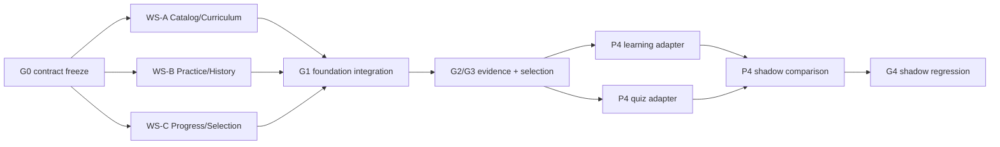
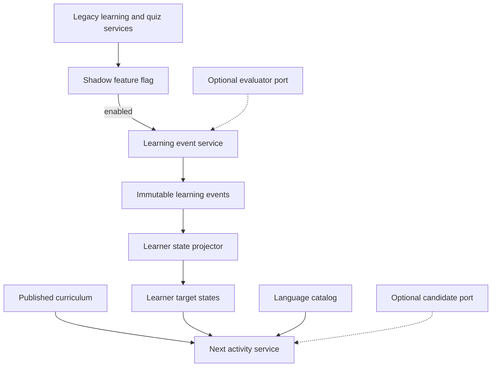

# SDD-backend: Основа языкового ассистента

> **Статус:** Accepted

- ADR: [`../adr/ADR-language-assistant-domain-model-2026-08-26.md`](../adr/ADR-language-assistant-domain-model-2026-08-26.md)
- PRD: [`../superpowers/specs/2026-08-26-domain-model-v0.1-design.md`](../superpowers/specs/2026-08-26-domain-model-v0.1-design.md)
- UX: нет; frontend и UI не входят в этот SDD
- LBS: нет; основа создаётся рядом с текущей моделью, без переключения существующих потребителей
- Progress: [`../progress/PROGRESS.md`](../progress/PROGRESS.md)
- Parallel execution design: [`../superpowers/specs/2026-08-26-parallel-sdd-execution-design.md`](../superpowers/specs/2026-08-26-parallel-sdd-execution-design.md)
- Revision 2 approved by the user on 2026-08-26 for three workstreams plus one integrator.

## 1. Обзор

SDD создаёт серверную основу для четырёх утверждённых ограниченных контекстов, не меняя существующие
публичные API и пользовательские сценарии. Новая модель сначала работает во внутреннем теневом
режиме: получает стабильные идентификаторы контента и целей, сохраняет события обучения, строит
проекции ученика и выбирает следующее действие через детерминированные политики.

Архитектурный стиль: чистые доменные модули, SQLAlchemy-маппинги хранения и прикладные сервисы.
Доменные модули не импортируют FastAPI или SQLAlchemy. Существующий способ передачи `Session` в
сервисы сохраняется; новый DI-фреймворк и отдельная абстракция unit of work не вводятся.

**Затронутые модули:**

- `backend/app/domain/` — новые агрегаты, объекты-значения, политики и порты;
- `backend/app/domain_models/` — context-owned ORM-маппинги и integrator-owned registry;
- `backend/app/repositories/` — context-owned операции хранения и контроль владения строками;
- `backend/app/services/` — начальная загрузка, запись событий, проекции, выбор и теневые адаптеры;
- `backend/alembic/` — создание схемы и обратимая миграция;
- `backend/tests/` — доменные, миграционные, интеграционные и конкурентные тесты, тесты replay.

**Существующий flow:**

- профиль создаётся и читается через `profile_service.py`;
- `learning_service.py` выбирает новые элементы и повторение, затем напрямую меняет
  `UserWordProgress`;
- `quiz_service.py` создаёт план теста, записывает `QuizAnswer` и в той же транзакции меняет прогресс;
- `models.py` и `schemas.py` являются общими плоскими модулями;
- Alembic импортирует `app.models`, а тестовые фикстуры создают `Base.metadata` в SQLite.

**Точки встраивания:**

- новые ORM-маппинги регистрируются в Alembic и тестовых метаданных без преобразования `app.models`
  в пакет;
- связь с текущей моделью опирается на `VocabularyItem.id` и `UserProfile.user_id`;
- теневые события добавляются до существующего `commit`, чтобы текущее изменение и свидетельство
  были атомарны;
- публичные схемы ответов и маршруты остаются неизменными.

## Errata vs ADR

| ADR-ref | В ADR | В SDD | Почему расхождение |
|---|---|---|---|
| §3, Learner Progress | State появляется только после evidence | Допускается явно помеченный `legacy_bootstrap` без synthetic events | Это уже требуется §3 Migration policy; SDD делает исключение исполнимым |
| §8, AI data flow | AI adapter показан только возле Practice | Candidate port подключён к selector, evaluator port — к Practice | Исправление направления зависимости без изменения AI boundary |
| §3, Practice & History | Retry lifecycle не уточнён | Каждый retry является новым связанным `ActivityInstance` | Сохраняет инвариант «один activity — один принятый event» при текущих quiz repeats |
| §3, Practice & History | `Submission` назван owned entity | В MVP это bounded `ResponseSubmission` value object команды | У него нет отдельной identity/lifecycle или persisted table; принятый результат атомарно становится event |
| §6, Risk 7 | Data lifecycle обязателен до free-form input | Production shadow history также gated этим решением | Даже bounded answer и learner ID уже являются learner data |

## 2. Реестр идентификаторов

| ID | Тип | Определён | NORMATIVE? |
|---|---|---|---|
| DTO-01 | value object | [P1.T1] § «Канонический блок: DTO-01» | да |
| SQL-01 | schema | [P1.T2] § «Канонический блок: SQL-01» | да |
| ALG-01 | algorithm | [P1.T1] § «Канонический блок: ALG-01» | да |
| EVENT-01 | domain event | [P2.T2] § «Канонический блок: EVENT-01» | да |
| ALG-02 | algorithm | [P2.T3] § «Канонический блок: ALG-02» | да |
| ALG-03 | algorithm | [P3.T2] § «Канонический блок: ALG-03» | да |
| ALG-04 | algorithm | [P3.T2] § «Канонический блок: ALG-04» | да |

## 3. План реализации

### Сводная таблица

| Фаза | ID | Название | Результат |
|---|---|---|---|
| 1 | P1 | [Контракты и контекстные foundations](SDD-backend-language-assistant-foundation-2026-08-26.P1.md) | Frozen contracts, context-owned modules и новая схема рядом с текущей моделью |
| 2 | P2 | [Неизменяемые свидетельства и проекции ученика](SDD-backend-language-assistant-foundation-2026-08-26.P2.md) | Идемпотентные события и low-confidence baseline дают replay-состояние на уровне цели |
| 3 | P3 | [Граница учебной программы и выбор действия](SDD-backend-language-assistant-foundation-2026-08-26.P3.md) | Валидированный pilot A1 и детерминированный выбор работают только внутри backend |
| 4 | P4 | [Теневая интеграция с текущей моделью](SDD-backend-language-assistant-foundation-2026-08-26.P4.md) | Текущие new/review/quiz-сценарии дублируют свидетельства под feature flag без изменения API |

Capability gates остаются последовательными: G0 contracts → G1 foundation → G2 evidence/projection
→ G3 curriculum/selection → G4 shadow. Реализация внутри gates параллельна: после G0 три workstream
работают по exclusive paths. P3 pure-domain selector можно разрабатывать с fakes параллельно P2,
но интегрировать только после зелёного projection contract. P4 включается только после
миграционных, replay- и конкурентных тестов P1–P3 на PostgreSQL.

### 3.1. Parallel execution topology

| Workstream | Владелец | Основная цепочка |
|---|---|---|
| WS-A | Language Catalog + Curriculum | P1.T3 → P1.T4 → P3.T1 → P3.T3 |
| WS-B | Practice & History | P1.T5 → P2.T1 → P2.T2 → P4.T3 |
| WS-C | Learner Progress + Selection | P1.T6 → P2.T3 → P2.T4 → P3.T2 → P4.T2 → P4.T4 (после P4.T3) |
| INT | Shared integration | P1.T1 → P1.T2 → P1.T7 → P2.T5 → P3.T4 → P4.T1 → P4.T5 (после P4.T2–T4) |



**Ownership rules:**

- один tracked path принадлежит только одному активному workstream;
- shared contracts, package registries, migration, общие fixtures и docs меняет только INT;
- изменение frozen contract оформляется отдельным contract-change commit с impact list до rebase;
- branch не merge-ready без локальных task tests и соответствующего gate;
- worktree каждого потока располагается вне repository tree.

## 4. Архитектурный поток



## 5. Глоссарий путей

```text
backend/alembic/env.py                                           (~)
backend/alembic/versions/20260826_0005_domain_foundation.py      (+)
backend/app/config.py                                            (~)
backend/app/db.py                                                (~)
backend/app/domain/__init__.py                                   (+)
backend/app/domain/catalog.py                                    (+)
backend/app/domain/curriculum.py                                 (+)
backend/app/domain/curriculum_policy.py                          (+)
backend/app/domain/memory_policy.py                              (+)
backend/app/domain/practice.py                                   (+)
backend/app/domain/practice_ports.py                             (+)
backend/app/domain/progress.py                                   (+)
backend/app/domain/selection_policy.py                           (+)
backend/app/domain/selection_ports.py                            (+)
backend/app/domain/shared.py                                     (+)
backend/app/domain/target.py                                     (+)
backend/app/domain_models/__init__.py                            (+)
backend/app/domain_models/catalog.py                             (+)
backend/app/domain_models/curriculum.py                          (+)
backend/app/domain_models/practice.py                            (+)
backend/app/domain_models/progress.py                            (+)
backend/app/repositories/__init__.py                             (+)
backend/app/repositories/catalog.py                              (+)
backend/app/repositories/curriculum.py                           (+)
backend/app/repositories/practice.py                             (+)
backend/app/repositories/progress.py                             (+)
backend/app/seed.py                                              (~)
backend/app/services/curriculum_service.py                       (+)
backend/app/services/domain_bootstrap_service.py                 (+)
backend/app/services/domain_shadow_contracts.py                  (+)
backend/app/services/learner_projection_service.py               (+)
backend/app/services/learning_event_service.py                   (+)
backend/app/services/learning_service.py                         (~)
backend/app/services/legacy_progress_bootstrap_service.py        (+)
backend/app/services/next_activity_service.py                    (+)
backend/app/services/practice_service.py                         (+)
backend/app/services/quiz_service.py                             (~)
backend/app/services/shadow_comparison_service.py                (+)
backend/app/services/shadow_learning_service.py                  (+)
backend/app/services/shadow_quiz_service.py                      (+)
backend/tests/conftest.py                                        (~)
backend/tests/test_curriculum.py                                 (+)
backend/tests/test_curriculum_contracts.py                       (+)
backend/tests/test_domain_catalog.py                             (+)
backend/tests/test_domain_contracts.py                           (+)
backend/tests/test_domain_shadow_contracts.py                    (+)
backend/tests/test_domain_shadow_integration.py                  (+)
backend/tests/test_learning.py                                   (~)
backend/tests/test_learning_events.py                            (+)
backend/tests/test_learning_shadow.py                            (+)
backend/tests/test_legacy_progress_bootstrap.py                  (+)
backend/tests/test_migrations.py                                 (~)
backend/tests/test_next_activity.py                              (+)
backend/tests/test_practice_contracts.py                         (+)
backend/tests/test_progress_contracts.py                         (+)
backend/tests/test_projection.py                                 (+)
backend/tests/test_quiz_shadow.py                                (+)
backend/tests/test_quizzes.py                                    (~)
backend/tests/test_shadow_comparison.py                          (+)
docs/product-state.md                                            (~)
docs/progress/PROGRESS.md                                        (~)
```

## 6. Открытые вопросы

Открытых вопросов, блокирующих реализацию P1–P3 и выключенного P4, нет. Production-включение shadow,
identity/access, переключение UI, промышленный AI-оценщик, политика жизненного цикла learning
history и паритет с текущим поведением относятся к следующим SDD и записаны в
`docs/progress/PROGRESS.md`.
