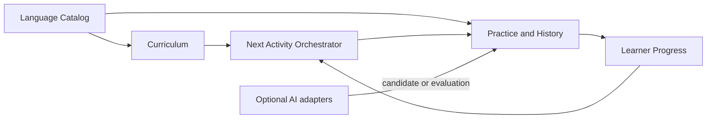
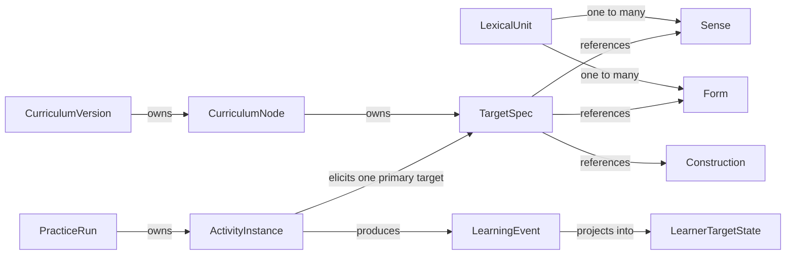

# Slovnik Domain Model v0.1

> **Статус:** Draft document; design approved; not implemented

- Дата: 2026-08-26
- Scope: MVP адаптивного ассистента по изучению сербского языка
- Теоретическая основа: `/Users/launert/deep-research-report.md`
- Текущее состояние продукта: [`../../product-state.md`](../../product-state.md)
- Progress и deferred log: [`../../progress/domain-model-v0.1.md`](../../progress/domain-model-v0.1.md)

## 1. Цель

Slovnik должен перейти от набора раздельных режимов «новые слова / повторение / тест» к
адаптивному учебному циклу. Система сама выбирает следующий педагогически допустимый и полезный
шаг на основании curriculum, наблюдаемого состояния ученика и риска забывания.

«Ассистент» здесь означает поведение учебной системы, а не AI-чат. AI может быть подключён как
заменяемый генератор кандидатов упражнений или проверяющий неоднозначные ответы, но не владеет
curriculum, progression, learner state или memory policy.

Документ фиксирует domain model, а не схему БД, API, production-код или UI.

## 2. Design principles

1. Language content, curriculum, learner competence, memory и activity — разные модели.
2. Learning target адресуется как `Target + Capability + Modality + optional Condition`.
3. Исторической истиной является immutable learning evidence, а не текущий progress score.
4. Competence и текущая retrievability моделируются раздельно.
5. CEFR задаёт outcome envelope и curriculum association, а не intrinsic difficulty слова.
6. HARD prerequisites отвечают за валидность activity; SOFT prerequisites влияют на ranking.
7. MVP материализует только знания и измерения, которые использует реально существующий сценарий.
8. AI-output считается недоверенным кандидатом и проходит те же доменные проверки, что curated content.

## 3. Рассмотренные варианты

### 3.1. Восемь bounded contexts из theoretical model

Отдельные Content, Knowledge, Curriculum, Exercise, History, Learner, Memory и Adaptation дают
чистую теоретическую декомпозицию, но создают избыточные границы и синхронизацию для MVP на
100–300 lexical units.

### 3.2. Расширение текущей word/card-модели

Минимизирует миграцию, но закрепляет текущие shortcuts: flat `VocabularyItem`, единый
`UserWordProgress`, CEFR как свойство слова, word-level mastery и card-centric scheduler. Такой
вариант не поддерживает senses, constructions и разные capabilities без дальнейшего переписывания.

### 3.3. Выбранный вариант: модульный монолит с четырьмя contexts

Четыре bounded contexts сохраняют фундаментальные семантические границы, но не превращают каждую
теоретическую concern в отдельный модуль или сервис. Memory и selection остаются заменяемыми
domain policies. History остаётся самостоятельной моделью внутри Practice & History.

## 4. Context map



### 4.1. Language Catalog

Описывает проверенный Serbian content: lexical identity, meanings, реально изучаемые forms,
orthographic representations и A1 constructions. Не хранит знания конкретного learner,
curriculum status или review schedule.

### 4.2. Curriculum

Определяет цели A1, target specifications, приоритеты, coverage и HARD/SOFT dependencies.
Вычисляет доступный frontier, но не решает, какой activity learner увидит прямо сейчас.

### 4.3. Practice & History

Формирует и исполняет ограниченный practice run, сохраняет точный snapshot activity, принимает
response, фиксирует evaluation и создаёт immutable evidence. Не владеет learner mastery.

### 4.4. Learner Progress

Хранит профиль обучения и sparse projections по конкретным target specifications. Раздельно
представляет competence evidence и memory availability.

## 5. Aggregate model

| Bounded context | Aggregate root | Внутренние entities | Ответственность |
|---|---|---|---|
| Language Catalog | `LexicalUnit` | `Sense`, `Form` | Целостность lexical entry и реально преподаваемых representations |
| Language Catalog | `Construction` | — | Самостоятельный form–meaning pattern сербского языка |
| Curriculum | `CurriculumVersion` | `CurriculumNode`, `PrerequisiteEdge` | Целостность опубликованного curriculum graph |
| Practice & History | `PracticeRun` | `ActivityInstance`, `Submission` | Последовательность activities и lifecycle учебного запуска |
| Practice & History | `LearningEvent` | — | Immutable evidence одного значимого encounter |
| Learner Progress | `LearnerProfile` | — | Учебные цели и preferences learner |
| Learner Progress | `LearnerTargetState` | — | Проекция evidence и memory для одного `TargetSpec` |

### 5.1. `LexicalUnit`

Представляет lexical identity: отдельное слово или multi-word expression.

- `Sense` — конкретное form–meaning mapping и основной lexical target.
- `Form` — реально преподаваемая surface realization. Для слова это citation или inflected form с
  morphosyntactic features; для MWE — canonical fixed expression form.
- Usage examples для MVP являются embedded value objects; отдельный sentence corpus не вводится.
- Полные paradigms не создаются заранее.

### 5.2. `Construction`

Представляет A1 form–meaning pattern, который нельзя корректно свести к lexical card: например,
location через `u/na + locative`, movement через `u/na + accusative`, basic agreement или modal
construction. В MVP construction содержит только необходимые constraints и примеры.

### 5.3. `CurriculumVersion`

Содержит согласованный snapshot A1 curriculum.

- `CurriculumNode` связывает цель/результат с одним `TargetSpec` и curriculum priority.
- `PrerequisiteEdge` связывает nodes и имеет тип `HARD` или `SOFT`.
- Published version неизменяема; изменение curriculum создаёт новую version.

### 5.4. `PracticeRun`

Фиксирует ограниченную учебную последовательность и позволяет продолжить, завершить или корректно
зафиксировать abandonment. Это устраняет нынешние эфемерные new/review sessions.

- `ActivityInstance` хранит один primary target и snapshot показанного задания.
- `Submission` хранит попытку learner до превращения результата в immutable evidence.
- В MVP один activity elicites один primary `TargetSpec`; incidental targets не обновляют state.

### 5.5. `LearningEvent`

Append-only факт учебного взаимодействия. Он фиксирует learner, target, activity intent,
operation, modality, cues, первый и итоговый response, evaluation, hints, latency, feedback и
policy/scorer versions в той полноте, в которой эти данные реально наблюдались.

Отсутствующие legacy-данные остаются unknown. Synthetic history из старых counters не создаётся.

### 5.6. `LearnerProfile`

Хранит только learning concerns: целевой уровень/цели, L1, темп и допустимые preferences. Identity,
authentication, roles и billing находятся вне этой domain model.

### 5.7. `LearnerTargetState`

Sparse projection с ключом `Learner + TargetSpec`. Создаётся только после появления evidence.

- `CompetenceEstimate` описывает наблюдаемую capability и uncertainty.
- `MemoryState` описывает current retrievability, schedule и policy version.
- `EvidenceSummary` хранит компактные counters/recency для explainability, но не заменяет events.
- State можно перестроить из `LearningEvent` с выбранной projection policy.

## 6. Value objects

### Language Catalog

- `EntryKind`: `WORD | MWE`.
- `OrthographicForm`: script + normalized text.
- `Gloss`: language + text.
- `StressPattern`.
- `MorphosyntacticFeatures`: валидированный sparse feature bundle.
- `UsageExample`: Serbian text, optional translation и target annotation.

### Curriculum

- `CEFRLevel` и `CEFROutcome`.
- `TargetRef`: ссылка типа `SENSE | WORD_FORM | CONSTRUCTION`.
- `TargetSpec`: target ref + capability + modality + optional condition.
- `PrerequisiteKind`: `HARD | SOFT`.
- `CurriculumPriority`.

### Practice & History

- `ActivitySpec`: target, operation, input/output modality, cue/support policy, stimulus snapshot,
  scoring policy и feedback policy.
- `LearningIntent`: `ACQUIRE | REVIEW | STRENGTHEN | ASSESS`.
- `Evaluation`: outcome, optional partial score/error tags и confidence.
- `EvaluationSource`: `DETERMINISTIC | SELF_REPORT | MODEL_ASSISTED`.
- `SelectionMetadata`: intent, policy version и selection reason.
- `IdempotencyKey`.

### Learner Progress

- `CompetenceEstimate`.
- `ModelUncertainty`.
- `MemoryState`.
- `EvidenceSummary`.
- `PolicyVersion`.

## 7. MVP taxonomies

### 7.1. Capabilities

- `RECOGNIZE_MEANING`
- `RETRIEVE_FORM`
- `APPLY_CONSTRUCTION`

### 7.2. Modalities

- `WRITTEN`

Audio и spoken modalities входят в расширяемую taxonomy, но learner state для них не создаётся,
пока MVP не получает достоверного audio/speech evidence.

### 7.3. Exercise operations

- `RECOGNIZE`
- `RETRIEVE`
- `COMPLETE`
- `TRANSFORM`

`EXPOSURE` является типом learning encounter, а не доказательством успешного retrieval.
Остальные theoretical primitives добавляются при появлении использующего их сценария.

## 8. Relations



- `CurriculumNode` ссылается на content через stable `TargetRef`, но не владеет content.
- `ActivityInstance` ссылается на один primary `TargetSpec` и сохраняет content snapshot.
- `LearningEvent` ссылается на learner, activity и target, не на mutable current content.
- `LearnerTargetState` соответствует ровно одному learner и одному `TargetSpec`.

## 9. Domain services and ports

### 9.1. `NextActivityOrchestrator`

Координирует выбор следующего шага, но не становится aggregate или источником данных.

```text
Learner profile + Learner target states + Memory risk + Curriculum frontier
→ choose learning intent
→ choose TargetSpec
→ build candidate activities
→ validate hard constraints
→ rank valid candidates
→ create ActivityInstance
```

Начальная ranking policy объяснима и versioned. Она учитывает review urgency, weak evidence,
curriculum priority, skill deficit, difficulty mismatch и repetition penalty. ML для выбора не нужен.

### 9.2. `CurriculumFrontierPolicy`

Определяет доступные targets на основании published curriculum и достаточно устойчивого competence
evidence. Temporary forgetting не отзывает ранее открытый curriculum branch.

### 9.3. `ActivityValidityPolicy`

Проверяет, что target действительно elicited, HARD prerequisites соблюдены, non-target burden
допустим, а scoring способен корректно оценить предусмотренный класс ответов.

### 9.4. `ActivityCandidateProvider`

Порт получения candidate `ActivitySpec`.

- Default adapter: curated/deterministic templates and content.
- Optional adapter: AI-generated candidate.

Provider не может создавать curriculum targets или публиковать activity без validation.

### 9.5. `ResponseEvaluator`

Порт оценки response.

- Default adapter: deterministic curated scorer.
- Optional adapter: AI evaluator для неоднозначных ответов.

AI evaluation должна сохранять evaluator/version/confidence и иметь policy fallback. Она не может
напрямую обновлять learner state.

### 9.6. `LearnerStateProjector` и `MemoryPolicy`

Projector интерпретирует validated events и обновляет competence projection. Memory policy отдельно
обновляет retrievability/schedule в зависимости от качества encounter. Обе policies versioned и
replaceable.

## 10. Core invariants

### Language Catalog

1. `LexicalUnit` имеет минимум один `Sense` и одну written `Form`.
2. Serbian form в MVP имеет проверенные Cyrillic и Latin representations.
3. Создаются только реально преподаваемые forms.
4. Stable content identity не переиспользуется для другого meaning.
5. Referenced published content не удаляется физически; оно versioned или retired.

### Curriculum

6. Published `CurriculumVersion` immutable.
7. Все target references published curriculum разрешимы.
8. HARD prerequisite graph ацикличен.
9. HARD edge влияет на допустимость; SOFT edge — только на ranking/learnability.
10. CEFR не является learner memory, item difficulty или word mastery.

### Practice & History

11. MVP activity имеет один primary elicited target.
12. `ActivityInstance` сохраняет stimulus и версии generator/scorer.
13. `LearningEvent` immutable и idempotent.
14. Event фиксирует только реально elicited capability.
15. Recognition не создаёт productive evidence.
16. Exposure не считается retrieval.
17. Self-rating не превращается в objective correctness.
18. Повторная обработка одного submission не обновляет state дважды.
19. Model-assisted evaluation сохраняет provenance и confidence; projection policy явно решает,
    какой evidence credit ей разрешён.

### Learner Progress

20. `LearnerTargetState` является replayable projection событий.
21. Competence и memory schedule не объединяются в один mastery score.
22. Overdue/weak memory state не отзывает curriculum unlock.
23. В canonical domain нет permanent `known`, `mastered` или word-level `weak` truth.
24. State update содержит projection policy version.

### AI boundary

25. AI не выбирает curriculum frontier и не изменяет progression.
26. AI-output проходит deterministic structural/domain validation.
27. AI не создаёт `LearningEvent` и не мутирует learner state напрямую.

## 11. Transaction and consistency boundaries

- Catalog publish проверяет целостность одного aggregate и его stable references.
- Curriculum publish проверяет все nodes, references и HARD graph целиком.
- Создание `PracticeRun` фиксирует curriculum/policy version и начальные selection constraints.
- Обработка submission идемпотентно переводит activity, добавляет `LearningEvent` и обновляет нужную
  projection. В MVP это может быть одна database transaction модульного монолита.
- Исторической истиной остаётся `LearningEvent`; learner projection должна быть rebuildable.
- Concurrent state updates сериализуются на уровне одного learner/target, а не всего learner.

## 12. Migration from current Slovnik

Миграция эволюционная, без big-bang rewrite.

1. Ввести stable content/target identities и mapping к существующим `VocabularyItem.id`.
2. Bootstrap каждый подходящий `VocabularyItem` как `LexicalUnit + default Sense + citation Form`;
   обе Serbian strings становятся orthographic representations.
3. CEFR/theme перенести как initial curriculum/editorial associations, не как intrinsic truth.
4. Старые example blobs сохранить как legacy content; не выдумывать отсутствующую разметку.
5. `UserWordProgress` преобразовать в low-confidence bootstrap projection и отдельный memory seed.
6. Historical new/review events не синтезировать: их невозможно достоверно восстановить.
7. `QuizAnswer` импортировать только как partial evidence с явно unknown latency/cues/policy metadata.
8. Начать dual-write новых `LearningEvent` и shadow learner projections.
9. Сравнить shadow projections с текущим поведением, затем переключить selection на новый orchestrator.
10. Legacy endpoints временно оставить facade над ограниченными learning intents.

AI generation cache/reservations остаются optional editorial subsystem и не мигрируют в learner core.

## 13. Extensible decisions for A1 to C2

Эти решения обязательны уже в MVP, хотя расширения пока не реализуются:

- Stable IDs у `Sense`, `Form`, `Construction`.
- Additive `TargetRef.kind`, capability, modality и exercise operation taxonomies.
- `OrthographicForm[]` и `Gloss[]` вместо fixed-language columns.
- `EntryKind` поддерживает MWE без отдельной mastery model.
- Sparse `MorphosyntacticFeatures` допускает новые Serbian feature types.
- Immutable versioned curriculum и content references.
- Immutable raw `LearningEvent` позволяет пересчитать будущие learner models.
- Generator, scorer, selection, memory и projection versions сохраняются с результатом.
- Memory scheduling скрыт за replaceable policy.
- AI integrations подключаются только через ports.
- Модульный монолит допускает последующее выделение History, Memory или Selection без смены IDs.

## 14. Deferred scope

Полный журнал с причинами и return triggers находится в
[`../../progress/domain-model-v0.1.md`](../../progress/domain-model-v0.1.md). В v0.1 намеренно не
материализуются:

- полный Serbian knowledge graph и generic `LinguisticObject` hierarchy;
- отдельные entities для grammar features, government, agreement, aspect, collocations и prosody;
- все forms всех lexemes и самостоятельный annotated sentence corpus;
- audio/speech capabilities и pronunciation scoring;
- multi-target evidence и credit для incidental encounters;
- полный набор из девяти exercise primitives;
- IRT, BKT, FSRS calibration, bandits, RL и deep knowledge tracing;
- automatic prerequisite discovery и unrestricted AI curriculum/content generation;
- production implementation AI providers;
- authentication, billing, native mobile и UI redesign.

## 15. Risks and trade-offs

- Stable target IDs и immutable events увеличивают начальную модель, но предотвращают потерю evidence.
- Один primary target упрощает интерпретацию learning signal, но ограничивает credit сложным activities.
- Embedded examples могут дублироваться; отдельный corpus появится только при доказанной потребности.
- Simple deterministic selection уступает будущей персонализации, но остаётся объяснимым и проверяемым.
- AI evaluation помогает со свободными ответами, но требует fallback из-за nondeterminism и false grading.
- Legacy bootstrap не восстанавливает истинное multidimensional mastery; imported state помечается как
  низкоуверенный prior.

## 16. Acceptance criteria for this model

Модель считается достаточной для перехода к Data Model/SDD, если она позволяет без новых core
entities описать:

1. Written recognition одного lexical sense.
2. Russian-to-Serbian retrieval конкретной form.
3. Применение базовой A1 construction в curated context.
4. Review того же target другим exercise operation.
5. Immutable фиксацию response/evaluation и replay learner state.
6. Выбор следующего activity из curriculum, competence и memory constraints.
7. Подключение AI generator/evaluator без передачи ему curriculum authority.
